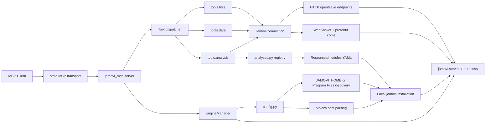

# jamovi MCP

[English](README.md) | [简体中文](README.zh-CN.md)

A local stdio MCP server that lets Claude, Cursor, and other MCP clients control [jamovi](https://www.jamovi.org/).

Open datasets, inspect schemas, edit cells, run statistical analyses, export results, and save `.omv` files through a local jamovi engine.


## Fastest Setup

Copy this into your MCP client config:

```json
{
  "mcpServers": {
    "jamovi": {
      "command": "uvx",
      "args": [
        "--from",
        "git+https://github.com/yjm110517/jamovi-mcp.git",
        "jamovi-mcp"
      ]
    }
  }
}
```

Restart your MCP client, then call `jamovi_open` with an absolute local data file path.

This is the recommended setup for normal users. You do not need to clone this repository, install a local `lib/` directory, or hardcode a machine-specific Python path.

## Requirements

- Windows
- jamovi installed locally
- `uvx` available to the MCP client
- A Python 3.12+ runtime available through `uvx` or your local Python setup

`uvx` is part of [uv](https://docs.astral.sh/uv/), a Python tool runner. In this README it is used so your MCP client can download and run `jamovi-mcp` from GitHub without cloning the repository or hardcoding a local Python path.

Install `uv` on Windows:

```powershell
winget install astral-sh.uv
```

jamovi itself is required because this MCP starts a local jamovi engine process. Python does not need to be installed in any specific directory.

## jamovi Version Discovery

By default, no `JAMOVI_HOME` configuration is required. The server scans standard Windows install locations such as Program Files and uses the newest valid `jamovi*` installation it finds.

Only set `JAMOVI_HOME` when jamovi is installed in a non-standard location or when you want to pin a specific version:

```json
{
  "mcpServers": {
    "jamovi": {
      "command": "uvx",
      "args": [
        "--from",
        "git+https://github.com/yjm110517/jamovi-mcp.git",
        "jamovi-mcp"
      ],
      "env": {
        "JAMOVI_HOME": "C:\\Path\\To\\jamovi"
      }
    }
  }
}
```

`JAMOVI_HOME` must point to the jamovi installation directory that contains `Frameworks` and `Resources`.

## Example Workflow

You can ask your MCP client to:

> Open `survey.csv`, show the variables, read the first 10 rows, run a t-test, and save the project as `analysis.omv`.


Typical tool sequence:

1. `jamovi_open`
2. `jamovi_get_schema`
3. `jamovi_get_data`
4. `jamovi_run_analysis`
5. `jamovi_save`

## MCP Tools

This server exposes 10 MCP tools.

| Tool | Purpose | Main arguments |
| --- | --- | --- |
| `jamovi_open` | Open a local data file in jamovi. | `file_path` |
| `jamovi_get_schema` | Read dataset metadata, columns, types, levels, and row counts. | None |
| `jamovi_get_data` | Read a rectangular data range as row-major JSON rows. | `row_start`, `row_count`, `column_start`, `column_count` |
| `jamovi_set_data` | Set one dataset cell. | `row`, `column`, `value` |
| `jamovi_list_analyses` | List analyses discovered from installed jamovi modules. | None |
| `jamovi_get_analysis_options` | Read the option schema for one analysis. | `ns`, `name` |
| `jamovi_run_analysis` | Run an analysis against the active dataset. | `ns`, `name`, `options`, `analysis_id` |
| `jamovi_get_analysis` | Fetch results for a previously run analysis. | `analysis_id` |
| `jamovi_export_results` | Export analysis results as text or HTML. | `analysis_id`, `fmt` |
| `jamovi_save` | Save the active dataset as an `.omv` file. | `file_path`, `overwrite` |

## Usage Examples

Open a CSV file:

```json
{
  "file_path": "C:\\Users\\you\\data\\example.csv"
}
```

Read the active dataset schema:

```json
{}
```

Read the first 10 rows and first 3 columns:

```json
{
  "row_start": 0,
  "row_count": 10,
  "column_start": 0,
  "column_count": 3
}
```

Set a single cell value:

```json
{
  "row": 0,
  "column": 1,
  "value": 10
}
```

Save the active dataset:

```json
{
  "file_path": "C:\\Users\\you\\data\\output.omv",
  "overwrite": true
}
```

Run an analysis:

```json
{
  "ns": "jmv",
  "name": "ttestIS",
  "options": {
    "vars": ["score"],
    "students": true
  },
  "analysis_id": 2
}
```

## Architecture




At startup, `EngineManager` selects a jamovi installation through `config.py`, builds the process environment from jamovi's own `bin/env.conf`, and launches `jamovi.server`. The MCP server connects to that local engine through `JamoviConnection`. File operations use jamovi's HTTP routes, while dataset and analysis operations use WebSocket messages encoded with the bundled protobuf definitions.

## Compatibility

Verified locally:

- Windows
- Python 3.12
- jamovi `2.6.19.0`

Designed compatibility:

- Any jamovi installation with the same `Frameworks`, `Resources`, `bin/env.conf`, HTTP routes, WebSocket API, and protobuf message contract.
- Optional version selection through `JAMOVI_HOME`.
- Automatic newest-version selection when multiple `jamovi*` directories are installed under standard Program Files locations.

Known limitation:

- If a future jamovi release changes `jamovi.proto`, the WebSocket request types, or the HTTP open/save routes, this MCP may need an adapter update and regenerated protobuf code.

## Troubleshooting

### `uvx` is not found

Install `uv` so your MCP client can run `uvx`, then restart the MCP client:

```powershell
winget install astral-sh.uv
```

`uvx` means "run a Python tool through uv". If you do not want to use `uvx`, use the development install below and configure the installed `jamovi-mcp` command instead.

### `jamovi-mcp requires Python 3.12 or newer`

Your MCP client is using an older Python runtime. With `uvx`, make sure `uv` can use Python 3.12+. If you manage Python yourself, point the MCP command to a Python 3.12+ executable:

```json
{
  "command": "C:\\Path\\To\\Python\\python.exe",
  "args": ["-m", "jamovi_mcp"]
}
```

This is an advanced fallback. It is not the recommended setup and the path will differ on every computer.

### `Invalid JAMOVI_HOME`

`JAMOVI_HOME` must point to the jamovi installation directory that contains `Frameworks` and `Resources`.

Example:

```json
{
  "env": {
    "JAMOVI_HOME": "C:\\Path\\To\\jamovi"
  }
}
```

### jamovi is installed but not detected

Set `JAMOVI_HOME` explicitly in the MCP client config. This is also recommended when testing a specific jamovi version.

### File open or save fails

Use absolute Windows paths and make sure the user running the MCP client has permission to read or write that location. For save operations, pass `"overwrite": true` if the target file already exists.

### Analysis tools return unexpected results

First call `jamovi_list_analyses`, then `jamovi_get_analysis_options` for the target analysis. jamovi analysis option schemas are module-specific and can differ between versions or installed modules.

## Development Install

Normal users should use the `uvx` MCP config above. Clone the repository only if you want to develop or test the code locally.

```powershell
git clone https://github.com/yjm110517/jamovi-mcp.git
cd jamovi-mcp
py -3.12 -m pip install -e .
```

If your system does not have the Windows Python launcher, use any Python 3.12+ executable instead:

```powershell
python -m pip install -e .
```

Run tests:

```powershell
py -3.12 -m pytest -q
```

Start the MCP server directly:

```powershell
py -3.12 -m jamovi_mcp
```

Important source areas:

- `src/jamovi_mcp/server.py`: MCP server and tool registration.
- `src/jamovi_mcp/engine.py`: jamovi engine subprocess lifecycle.
- `src/jamovi_mcp/config.py`: jamovi install discovery and environment setup.
- `src/jamovi_mcp/connection.py`: HTTP, WebSocket, and protobuf communication.
- `src/jamovi_mcp/tools/`: MCP tool implementations.
- `src/jamovi_mcp/analyses.py`: analysis registry built from jamovi module YAML files.
- `tests/`: unit tests for data conversion, save handling, config, and engine env setup.

Do not commit `lib/` or other local dependency target directories. Install dependencies through `pyproject.toml`.

## Security Notes

This MCP starts a local jamovi process and reads or writes local files whose paths are provided through MCP tool calls.

- The engine is started locally and connected through `127.0.0.1`.
- File paths are supplied by the MCP client/user.
- Do not expose this server to untrusted clients.
- Do not pass sensitive data files to an MCP client you do not trust.
- Do not commit private local config, access tokens, API keys, or datasets.

## Roadmap

- Add GitHub Actions CI.
- Add broader integration tests across more jamovi versions.
- Improve structured parsing for analysis result payloads.
- Add more explicit typed response schemas for each MCP tool.
- Document common jamovi analysis recipes.

## Contributing

Pull requests are welcome. Please keep changes focused, run the test suite before submitting, and include tests for behavior changes.

For compatibility work, include the jamovi version, Windows version, and Python version used for testing.

## Repository Contents

Files that should be committed:

- `README.md`
- `README.zh-CN.md`
- `LICENSE`
- `.gitignore`
- `pyproject.toml`
- `docs/`
- `src/`
- `tests/`

Files and directories that should not be committed:

- `lib/`
- `.pytest_cache/`
- `.ruff_cache/`
- `__pycache__/`
- local CSV/OMV/log/tmp files
- private local config, tokens, and API keys

## License

MIT
