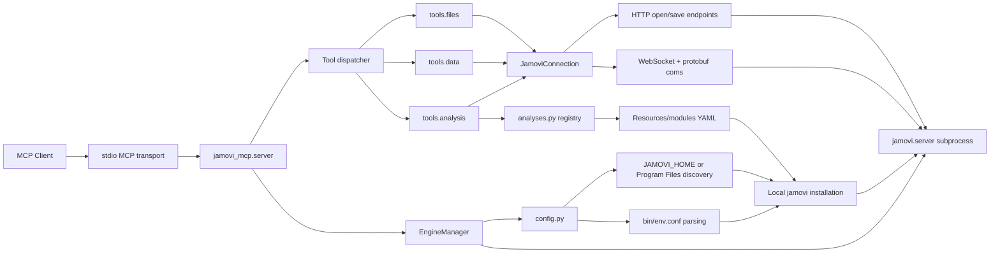

# jamovi MCP

[English](README.md) | [简体中文](README.zh-CN.md)

MCP server for controlling [jamovi](https://www.jamovi.org/) from MCP clients. It starts a local jamovi engine process, connects through jamovi's WebSocket/protobuf API, and exposes tools for opening datasets, reading and writing data, running analyses, exporting results, and saving `.omv` files.


## Features

- Start and manage a local jamovi engine process.
- Open `.omv`, `.csv`, `.sav`, `.xlsx`, `.ods`, `.dta`, `.sas7bdat`, `.por`, and `.txt` files.
- Inspect dataset schema, including row count, column count, column types, measure types, and levels.
- Read data in row-major JSON form.
- Write single cell values, including missing values.
- List available jamovi analyses and inspect option schemas from installed modules.
- Run analyses and retrieve/export results.
- Save the active dataset as an `.omv` file.

## Architecture



At startup, `EngineManager` selects a jamovi installation through `config.py`, builds the process environment from jamovi's own `bin/env.conf`, and launches `jamovi.server`. The MCP server then connects to that local engine through `JamoviConnection`. File operations use jamovi's HTTP routes, while dataset and analysis operations use WebSocket messages encoded with the bundled protobuf definitions.

## Quick Start

1. Install jamovi on Windows.
2. Install Python 3.12 or newer.
3. Install this package from the repository root:

```powershell
C:\Python312\python.exe -m pip install -e .
```

4. Add the MCP server to your MCP client config:

```json
{
  "mcpServers": {
    "jamovi": {
      "command": "C:\\Python312\\python.exe",
      "args": ["-m", "jamovi_mcp"]
    }
  }
}
```

5. Restart your MCP client and call `jamovi_open` with an absolute dataset path.


## Tools

This server exposes 10 MCP tools.

| Tool | Purpose | Main arguments |
| --- | --- | --- |
| `jamovi_open` | Open a local data file in jamovi. | `file_path` |
| `jamovi_get_schema` | Read dataset metadata, columns, types, levels, and row counts. | None |
| `jamovi_get_data` | Read a rectangular data range as row-major JSON rows. | `row_start`, `row_count`, `column_start`, `column_count` |
| `jamovi_set_data` | Set one dataset cell. | `row`, `column`, `value` |
| `jamovi_list_analyses` | List analyses discovered from installed jamovi modules. | None |
| `jamovi_get_analysis_options` | Read the option schema for one analysis. | `ns`, `name` |
| `jamovi_run_analysis` | Run an analysis against the active dataset. | `ns`, `name`, `options`, `analysis_id` |
| `jamovi_get_analysis` | Fetch results for a previously run analysis. | `analysis_id` |
| `jamovi_export_results` | Export analysis results as text or HTML. | `analysis_id`, `fmt` |
| `jamovi_save` | Save the active dataset as an `.omv` file. | `file_path`, `overwrite` |

## Usage Examples

Open a CSV file:

```json
{
  "file_path": "C:\\Users\\you\\data\\example.csv"
}
```

Read the active dataset schema:

```json
{}
```

Read the first 10 rows and first 3 columns:

```json
{
  "row_start": 0,
  "row_count": 10,
  "column_start": 0,
  "column_count": 3
}
```

Set a single cell value:

```json
{
  "row": 0,
  "column": 1,
  "value": 10
}
```

Save the active dataset:

```json
{
  "file_path": "C:\\Users\\you\\data\\output.omv",
  "overwrite": true
}
```

List available analyses, then inspect one analysis option schema:

```json
{}
```

```json
{
  "ns": "jmv",
  "name": "ttestIS"
}
```

Run an analysis:

```json
{
  "ns": "jmv",
  "name": "ttestIS",
  "options": {
    "vars": ["score"],
    "students": true
  },
  "analysis_id": 2
}
```

## Requirements

- Windows
- Python 3.12 or newer
- jamovi installed locally

The project is tested with jamovi `2.6.19.0`, but the startup code is not pinned to that version. It supports:

- explicit `JAMOVI_HOME`
- automatic discovery of installed `jamovi*` directories under `Program Files`
- dynamic environment setup from jamovi's own `bin/env.conf`

If multiple jamovi versions are installed, the newest detected version is selected by default.

## Compatibility

Verified locally:

- Windows
- Python 3.12
- jamovi `2.6.19.0`

Designed compatibility:

- Any jamovi installation with the same `Frameworks`, `Resources`, `bin/env.conf`, HTTP routes, WebSocket API, and protobuf message contract.
- Explicit version selection through `JAMOVI_HOME`.
- Automatic newest-version selection when multiple `jamovi*` directories are installed under standard Program Files locations.

Known limitation:

- If a future jamovi release changes `jamovi.proto`, the WebSocket request types, or the HTTP open/save routes, this MCP may need an adapter update and regenerated protobuf code.

## Installation

From the repository root:

```powershell
C:\Python312\python.exe -m pip install -e .
```

For local development:

```powershell
C:\Python312\python.exe -m pip install -e .
C:\Python312\python.exe -m pip install pytest
```

Do not commit a local `lib/` dependency target directory. Dependencies should be installed from `pyproject.toml`.

## jamovi Selection

By default, the server scans standard Windows install locations and uses the newest valid jamovi installation.

To force a specific jamovi version:

```powershell
$env:JAMOVI_HOME = "C:\Program Files\jamovi 2.6.19.0"
C:\Python312\python.exe -m jamovi_mcp
```

`JAMOVI_HOME` must point to the jamovi install directory that contains `Frameworks` and `Resources`.

## MCP Client Configuration

Example MCP server config:

```json
{
  "mcpServers": {
    "jamovi": {
      "command": "C:\\Python312\\python.exe",
      "args": ["-m", "jamovi_mcp"],
      "env": {
        "JAMOVI_HOME": "C:\\Program Files\\jamovi 2.6.19.0"
      }
    }
  }
}
```

If you want automatic jamovi version discovery, omit `JAMOVI_HOME`:

```json
{
  "mcpServers": {
    "jamovi": {
      "command": "C:\\Python312\\python.exe",
      "args": ["-m", "jamovi_mcp"]
    }
  }
}
```

Use Python 3.12 or newer. Running with an older default `python` will fail with a clear startup error.

## Running Tests

```powershell
C:\Python312\python.exe -m pytest -q
```

The test suite covers:

- jamovi install discovery and environment parsing
- HTTP save endpoint handling
- data block column-major to row-major conversion
- `set_data` request construction

## Development

Install in editable mode:

```powershell
C:\Python312\python.exe -m pip install -e .
```

Run tests:

```powershell
C:\Python312\python.exe -m pytest -q
```

Start the MCP server directly:

```powershell
C:\Python312\python.exe -m jamovi_mcp
```

Important source areas:

- `src/jamovi_mcp/server.py`: MCP server and tool registration.
- `src/jamovi_mcp/engine.py`: jamovi engine subprocess lifecycle.
- `src/jamovi_mcp/config.py`: jamovi install discovery and environment setup.
- `src/jamovi_mcp/connection.py`: HTTP, WebSocket, and protobuf communication.
- `src/jamovi_mcp/tools/`: MCP tool implementations.
- `src/jamovi_mcp/analyses.py`: analysis registry built from jamovi module YAML files.
- `tests/`: unit tests for data conversion, save handling, config, and engine env setup.

Do not commit `lib/` or other local dependency target directories. Install dependencies through `pyproject.toml`.

## Troubleshooting

### `jamovi-mcp requires Python 3.12 or newer`

Your MCP client is probably using an older default `python`. Set the MCP command to the full Python 3.12 path:

```json
{
  "command": "C:\\Python312\\python.exe",
  "args": ["-m", "jamovi_mcp"]
}
```

### `Invalid JAMOVI_HOME`

`JAMOVI_HOME` must point to the jamovi installation directory that contains `Frameworks` and `Resources`.

Example:

```powershell
$env:JAMOVI_HOME = "C:\Program Files\jamovi 2.6.19.0"
```

### jamovi is installed but not detected

Set `JAMOVI_HOME` explicitly in the MCP client config. This is also recommended when testing a specific jamovi version.

### File open or save fails

Use absolute Windows paths and make sure the user running the MCP client has permission to read or write that location. For save operations, pass `"overwrite": true` if the target file already exists.

### Analysis tools return unexpected results

First call `jamovi_list_analyses`, then `jamovi_get_analysis_options` for the target analysis. jamovi analysis option schemas are module-specific and can differ between versions or installed modules.

## Security Notes

This MCP starts a local jamovi process and reads or writes local files whose paths are provided through MCP tool calls.

- The engine is started locally and connected through `127.0.0.1`.
- File paths are supplied by the MCP client/user.
- Do not expose this server to untrusted clients.
- Do not pass sensitive data files to an MCP client you do not trust.
- Do not commit private local config, access tokens, API keys, or datasets.

## Roadmap

- Add GitHub Actions CI.
- Add broader integration tests across more jamovi versions.
- Improve structured parsing for analysis result payloads.
- Add more explicit typed response schemas for each MCP tool.
- Document common jamovi analysis recipes.

## Contributing

Pull requests are welcome. Please keep changes focused, run the test suite before submitting, and include tests for behavior changes.

For compatibility work, include the jamovi version, Windows version, and Python version used for testing.

## Repository Contents

Files that should be committed:

- `README.md`
- `LICENSE`
- `.gitignore`
- `pyproject.toml`
- `src/`
- `tests/`

Files and directories that should not be committed:

- `lib/`
- `.pytest_cache/`
- `.ruff_cache/`
- `__pycache__/`
- local CSV/OMV/log/tmp files
- private local config, tokens, and API keys

## License

MIT
