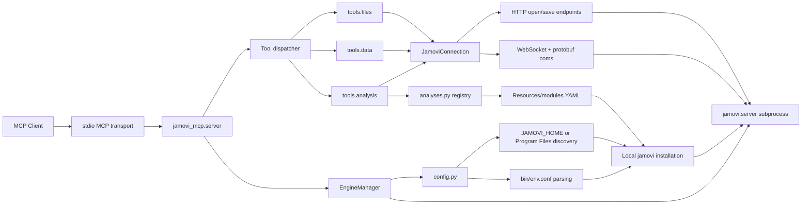

# jamovi MCP

[English](README.md) | [简体中文](README.zh-CN.md)

用于从 MCP 客户端控制 [jamovi](https://www.jamovi.org/) 的 MCP 服务器。它会启动本地 jamovi engine 进程，通过 jamovi 的 WebSocket/protobuf API 建立连接，并提供打开数据集、读取和写入数据、运行分析、导出结果、保存 `.omv` 文件等工具。


## 功能

- 启动并管理本地 jamovi engine 进程。
- 打开 `.omv`、`.csv`、`.sav`、`.xlsx`、`.ods`、`.dta`、`.sas7bdat`、`.por` 和 `.txt` 文件。
- 查看数据集 schema，包括行数、列数、列类型、测量类型和水平信息。
- 以行优先 JSON 形式读取数据。
- 写入单个单元格，包括缺失值。
- 从已安装的 jamovi 模块中列出可用分析，并查看分析参数 schema。
- 运行分析并获取或导出结果。
- 将当前数据集保存为 `.omv` 文件。

## 架构



启动时，`EngineManager` 通过 `config.py` 选择 jamovi 安装目录，根据 jamovi 自带的 `bin/env.conf` 构造运行环境，并启动 `jamovi.server`。随后 MCP server 通过 `JamoviConnection` 连接到本地 engine。文件操作使用 jamovi 的 HTTP 路由，数据集和分析操作使用 WebSocket 消息，并通过仓库内的 protobuf 定义进行编码。

## 快速开始

1. 在 Windows 上安装 jamovi。
2. 安装 Python 3.12 或更新版本。
3. 在仓库根目录安装本项目：

```powershell
C:\Python312\python.exe -m pip install -e .
```

4. 将 MCP server 加入你的 MCP 客户端配置：

```json
{
  "mcpServers": {
    "jamovi": {
      "command": "C:\\Python312\\python.exe",
      "args": ["-m", "jamovi_mcp"]
    }
  }
}
```

5. 重启 MCP 客户端，然后使用 `jamovi_open` 打开一个绝对路径的数据文件。


## 工具

本服务器提供 10 个 MCP tools。

| Tool | 作用 | 主要参数 |
| --- | --- | --- |
| `jamovi_open` | 在 jamovi 中打开本地数据文件。 | `file_path` |
| `jamovi_get_schema` | 读取数据集元数据、列信息、类型、水平和行数。 | 无 |
| `jamovi_get_data` | 以行优先 JSON 形式读取一个矩形数据范围。 | `row_start`, `row_count`, `column_start`, `column_count` |
| `jamovi_set_data` | 写入一个数据集单元格。 | `row`, `column`, `value` |
| `jamovi_list_analyses` | 列出从已安装 jamovi 模块中发现的分析。 | 无 |
| `jamovi_get_analysis_options` | 读取某个分析的参数 schema。 | `ns`, `name` |
| `jamovi_run_analysis` | 在当前数据集上运行分析。 | `ns`, `name`, `options`, `analysis_id` |
| `jamovi_get_analysis` | 获取已运行分析的结果。 | `analysis_id` |
| `jamovi_export_results` | 将分析结果导出为文本或 HTML。 | `analysis_id`, `fmt` |
| `jamovi_save` | 将当前数据集保存为 `.omv` 文件。 | `file_path`, `overwrite` |

## 使用示例

打开 CSV 文件：

```json
{
  "file_path": "C:\\Users\\you\\data\\example.csv"
}
```

读取当前数据集 schema：

```json
{}
```

读取前 10 行、前 3 列：

```json
{
  "row_start": 0,
  "row_count": 10,
  "column_start": 0,
  "column_count": 3
}
```

写入单个单元格：

```json
{
  "row": 0,
  "column": 1,
  "value": 10
}
```

保存当前数据集：

```json
{
  "file_path": "C:\\Users\\you\\data\\output.omv",
  "overwrite": true
}
```

列出可用分析，然后查看某个分析的参数 schema：

```json
{}
```

```json
{
  "ns": "jmv",
  "name": "ttestIS"
}
```

运行分析：

```json
{
  "ns": "jmv",
  "name": "ttestIS",
  "options": {
    "vars": ["score"],
    "students": true
  },
  "analysis_id": 2
}
```

## 环境要求

- Windows
- Python 3.12 或更新版本
- 本机已安装 jamovi

本项目已在 jamovi `2.6.19.0` 上测试，但启动代码不绑定该版本。它支持：

- 显式设置 `JAMOVI_HOME`
- 自动发现 `Program Files` 下已安装的 `jamovi*` 目录
- 从 jamovi 自带的 `bin/env.conf` 动态构造运行环境

如果安装了多个 jamovi 版本，默认会选择检测到的最新版本。

## 兼容性

本机已验证：

- Windows
- Python 3.12
- jamovi `2.6.19.0`

设计上支持：

- 具有相同 `Frameworks`、`Resources`、`bin/env.conf`、HTTP 路由、WebSocket API 和 protobuf 消息契约的 jamovi 安装。
- 通过 `JAMOVI_HOME` 指定具体版本。
- 当标准 Program Files 位置下存在多个 `jamovi*` 安装目录时，自动选择最新版本。

已知限制：

- 如果未来 jamovi 改动 `jamovi.proto`、WebSocket 请求类型或 HTTP open/save 路由，本 MCP 可能需要更新适配层并重新生成 protobuf 代码。

## 安装

在仓库根目录执行：

```powershell
C:\Python312\python.exe -m pip install -e .
```

本地开发：

```powershell
C:\Python312\python.exe -m pip install -e .
C:\Python312\python.exe -m pip install pytest
```

不要提交本地 `lib/` 依赖目录。依赖应通过 `pyproject.toml` 安装。

## jamovi 版本选择

默认情况下，服务器会扫描标准 Windows 安装位置，并使用检测到的最新有效 jamovi 安装。

如需强制指定某个 jamovi 版本：

```powershell
$env:JAMOVI_HOME = "C:\Program Files\jamovi 2.6.19.0"
C:\Python312\python.exe -m jamovi_mcp
```

`JAMOVI_HOME` 必须指向包含 `Frameworks` 和 `Resources` 的 jamovi 安装目录。

## MCP 客户端配置

示例 MCP server 配置：

```json
{
  "mcpServers": {
    "jamovi": {
      "command": "C:\\Python312\\python.exe",
      "args": ["-m", "jamovi_mcp"],
      "env": {
        "JAMOVI_HOME": "C:\\Program Files\\jamovi 2.6.19.0"
      }
    }
  }
}
```

如果希望自动发现 jamovi 版本，可以省略 `JAMOVI_HOME`：

```json
{
  "mcpServers": {
    "jamovi": {
      "command": "C:\\Python312\\python.exe",
      "args": ["-m", "jamovi_mcp"]
    }
  }
}
```

请使用 Python 3.12 或更新版本。使用旧版本默认 `python` 启动时，会输出明确的版本错误。

## 运行测试

```powershell
C:\Python312\python.exe -m pytest -q
```

测试覆盖：

- jamovi 安装发现和环境解析
- HTTP save endpoint 处理
- jamovi 列优先数据块到行优先 JSON 的转换
- `set_data` 请求构造

## 开发

以 editable 模式安装：

```powershell
C:\Python312\python.exe -m pip install -e .
```

运行测试：

```powershell
C:\Python312\python.exe -m pytest -q
```

直接启动 MCP server：

```powershell
C:\Python312\python.exe -m jamovi_mcp
```

关键源码位置：

- `src/jamovi_mcp/server.py`：MCP server 和 tool 注册。
- `src/jamovi_mcp/engine.py`：jamovi engine 子进程生命周期。
- `src/jamovi_mcp/config.py`：jamovi 安装发现和运行环境构造。
- `src/jamovi_mcp/connection.py`：HTTP、WebSocket 和 protobuf 通信。
- `src/jamovi_mcp/tools/`：MCP tool 实现。
- `src/jamovi_mcp/analyses.py`：从 jamovi 模块 YAML 构建分析注册表。
- `tests/`：数据转换、保存、配置和 engine 环境构造的单元测试。

不要提交 `lib/` 或其他本地依赖目录。请通过 `pyproject.toml` 安装依赖。

## 故障排查

### `jamovi-mcp requires Python 3.12 or newer`

你的 MCP 客户端很可能使用了较旧的默认 `python`。请把 MCP command 设置为 Python 3.12 的完整路径：

```json
{
  "command": "C:\\Python312\\python.exe",
  "args": ["-m", "jamovi_mcp"]
}
```

### `Invalid JAMOVI_HOME`

`JAMOVI_HOME` 必须指向包含 `Frameworks` 和 `Resources` 的 jamovi 安装目录。

示例：

```powershell
$env:JAMOVI_HOME = "C:\Program Files\jamovi 2.6.19.0"
```

### 已安装 jamovi 但没有被检测到

请在 MCP 客户端配置中显式设置 `JAMOVI_HOME`。测试特定 jamovi 版本时也建议这样做。

### 打开或保存文件失败

请使用 Windows 绝对路径，并确认运行 MCP 客户端的用户有对应路径的读写权限。保存时，如果目标文件已存在，请传入 `"overwrite": true`。

### 分析工具返回结果不符合预期

先调用 `jamovi_list_analyses`，再对目标分析调用 `jamovi_get_analysis_options`。jamovi 分析参数 schema 由模块决定，不同版本或不同已安装模块可能存在差异。

## 安全说明

这个 MCP 会启动本地 jamovi 进程，并根据 MCP tool 调用中提供的路径读取或写入本地文件。

- engine 在本机启动，并通过 `127.0.0.1` 连接。
- 文件路径由 MCP 客户端或用户提供。
- 不要将此服务器暴露给不可信客户端。
- 不要把敏感数据文件交给不可信 MCP 客户端处理。
- 不要提交本地私有配置、access token、API key 或数据集。

## 路线图

- 添加 GitHub Actions CI。
- 增加更多 jamovi 版本的集成测试。
- 改进分析结果 payload 的结构化解析。
- 为每个 MCP tool 添加更明确的类型化返回 schema。
- 补充常见 jamovi 分析 recipe 文档。

## 贡献

欢迎提交 Pull Request。请保持改动聚焦，提交前运行测试，并为行为变更补充测试。

兼容性相关改动请说明测试所用的 jamovi 版本、Windows 版本和 Python 版本。

## 仓库内容

应提交的文件：

- `README.md`
- `README.zh-CN.md`
- `LICENSE`
- `.gitignore`
- `pyproject.toml`
- `src/`
- `tests/`

不应提交的文件和目录：

- `lib/`
- `.pytest_cache/`
- `.ruff_cache/`
- `__pycache__/`
- 本地 CSV、OMV、日志和临时文件
- 本机私有配置、token 和 API key

## 许可证

MIT
