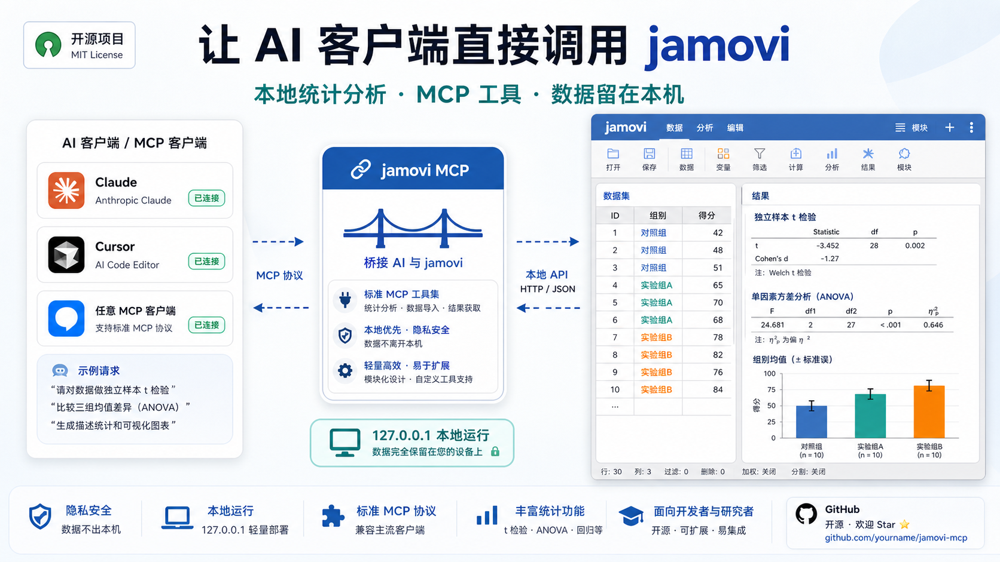
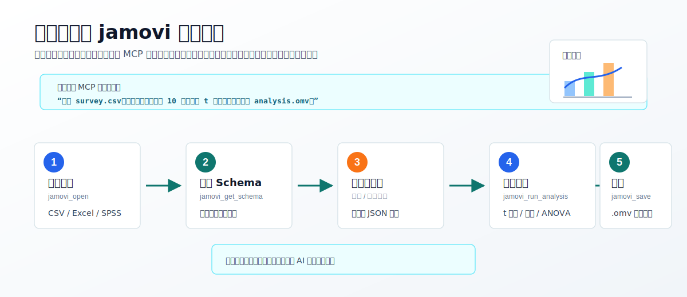
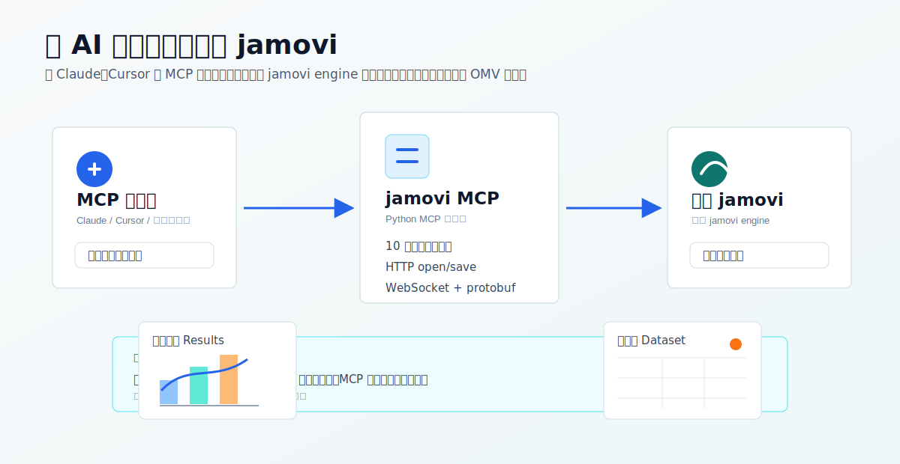
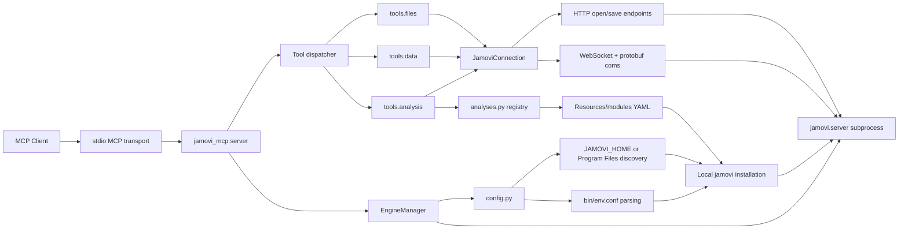

# jamovi MCP

[English](README.md) | [简体中文](README.zh-CN.md)

一个本地 stdio MCP server，让 Claude、Cursor 等 MCP 客户端可以直接控制 [jamovi](https://www.jamovi.org/)。

通过本地 jamovi engine 打开数据集、查看 schema、编辑单元格、运行统计分析、导出结果，并保存 `.omv` 文件。



## 最快部署

把下面这段配置复制到你的 MCP 客户端配置里。Claude Code、Claude Desktop、Cursor 这类 stdio MCP 客户端通常都使用这种 `command` + `args` 结构：

```json
{
  "mcpServers": {
    "jamovi": {
      "command": "uvx",
      "args": [
        "--from",
        "git+https://github.com/yjm110517/jamovi-mcp.git",
        "jamovi-mcp"
      ]
    }
  }
}
```

如果你用的是 Claude Code，不要额外添加 `"type": "stdio"`，也不要把示例里的 `JAMOVI_HOME` 占位路径复制进去。保持上面这段最小配置即可。

可选自检：

```powershell
uvx --from git+https://github.com/yjm110517/jamovi-mcp.git -- jamovi-mcp --check
```

看到 `jamovi: ...` 和 `MCP transport: stdio` 后，重启 MCP 客户端，然后调用 `jamovi_open`，传入一个本地数据文件的 Windows 绝对路径。

这是普通用户推荐的部署方式。你不需要 clone 仓库，不需要手动安装 `lib/`，也不需要把 Python 写死到某台电脑上的本机路径。

## 前置条件

- Windows
- 本机已安装 jamovi
- MCP 客户端能调用 `uvx`
- `uvx` 或你的本地 Python 环境能使用 Python 3.10+

`uvx` 是 [uv](https://docs.astral.sh/uv/) 提供的 Python 工具运行命令。这里使用 `uvx` 的目的，是让 MCP 客户端可以直接从 GitHub 下载并运行 `jamovi-mcp`，不用 clone 仓库，也不用写死本机 Python 路径。

Windows 上可以这样安装 `uv`：

```powershell
winget install astral-sh.uv
```

安装后如果 MCP 客户端仍然提示找不到 `uvx`，请重启 MCP 客户端，必要时重启终端或系统，让新的 PATH 生效。

jamovi 是必要条件，因为这个 MCP 会启动本地 jamovi engine。Python 不需要安装在任何固定目录。

## jamovi 版本发现

默认情况下不需要配置 `JAMOVI_HOME`。服务器会扫描 Windows 标准安装位置，例如 Program Files，并使用检测到的最新有效 `jamovi*` 安装目录。

只有在 jamovi 安装到非标准位置，或者你想固定使用某个 jamovi 版本时，才需要设置 `JAMOVI_HOME`。下面的路径只是示例，必须换成你自己电脑上的真实 jamovi 安装目录：

```json
{
  "mcpServers": {
    "jamovi": {
      "command": "uvx",
      "args": [
        "--from",
        "git+https://github.com/yjm110517/jamovi-mcp.git",
        "jamovi-mcp"
      ],
      "env": {
        "JAMOVI_HOME": "C:\\Your\\jamovi\\Install\\Path"
      }
    }
  }
}
```

`JAMOVI_HOME` 必须指向包含 `Frameworks` 和 `Resources` 的 jamovi 安装目录。如果你不确定这个路径，就先不要配置 `JAMOVI_HOME`，让 MCP 自动发现。

## 示例工作流

你可以让 MCP 客户端执行：

> 打开 `survey.csv`，查看变量，读取前 10 行，运行 t 检验，然后保存为 `analysis.omv`。



典型 tool 调用顺序：

1. `jamovi_open`
2. `jamovi_get_schema`
3. `jamovi_get_data`
4. `jamovi_run_analysis`
5. `jamovi_save`

## MCP Tools

本服务器提供 10 个 MCP tools。

| Tool | 作用 | 主要参数 |
| --- | --- | --- |
| `jamovi_open` | 在 jamovi 中打开本地数据文件。 | `file_path` |
| `jamovi_get_schema` | 读取数据集元数据、列信息、类型、水平和行数。 | 无 |
| `jamovi_get_data` | 以行优先 JSON 形式读取一个矩形数据范围。 | `row_start`, `row_count`, `column_start`, `column_count` |
| `jamovi_set_data` | 写入一个数据集单元格。 | `row`, `column`, `value` |
| `jamovi_list_analyses` | 列出从已安装 jamovi 模块中发现的分析。 | 无 |
| `jamovi_get_analysis_options` | 读取某个分析的参数 schema。 | `ns`, `name` |
| `jamovi_run_analysis` | 在当前数据集上运行分析。 | `ns`, `name`, `options`, `analysis_id` |
| `jamovi_get_analysis` | 获取已运行分析的结果。 | `analysis_id` |
| `jamovi_export_results` | 将分析结果导出为文本或 HTML。 | `analysis_id`, `fmt` |
| `jamovi_save` | 将当前数据集保存为 `.omv` 文件。 | `file_path`, `overwrite` |

## 使用示例

打开 CSV 文件：

```json
{
  "file_path": "C:\\Users\\you\\data\\example.csv"
}
```

读取当前数据集 schema：

```json
{}
```

读取前 10 行、前 3 列：

```json
{
  "row_start": 0,
  "row_count": 10,
  "column_start": 0,
  "column_count": 3
}
```

写入单个单元格：

```json
{
  "row": 0,
  "column": 1,
  "value": 10
}
```

保存当前数据集：

```json
{
  "file_path": "C:\\Users\\you\\data\\output.omv",
  "overwrite": true
}
```

运行分析：

```json
{
  "ns": "jmv",
  "name": "ttestIS",
  "options": {
    "vars": ["score"],
    "students": true
  },
  "analysis_id": 2
}
```

## 架构





启动时，`EngineManager` 通过 `config.py` 选择 jamovi 安装目录，根据 jamovi 自带的 `bin/env.conf` 构造运行环境，并启动 `jamovi.server`。随后 MCP server 通过 `JamoviConnection` 连接到本地 engine。文件操作使用 jamovi 的 HTTP 路由，数据集和分析操作使用 WebSocket 消息，并通过仓库内的 protobuf 定义进行编码。

## 兼容性

本机已验证：

- Windows
- Python 3.10 - 3.12
- jamovi `2.6.19.0`

设计上支持：

- 具有相同 `Frameworks`、`Resources`、`bin/env.conf`、HTTP 路由、WebSocket API 和 protobuf 消息契约的 jamovi 安装。
- 通过 `JAMOVI_HOME` 可选指定具体版本。
- 当标准 Program Files 位置下存在多个 `jamovi*` 安装目录时，自动选择最新版本。

已知限制：

- 如果未来 jamovi 改动 `jamovi.proto`、WebSocket 请求类型或 HTTP open/save 路由，本 MCP 可能需要更新适配层并重新生成 protobuf 代码。

## 故障排查

### 找不到 `uvx`

请安装 `uv`，让 MCP 客户端可以调用 `uvx`，然后重启 MCP 客户端：

```powershell
winget install astral-sh.uv
```

`uvx` 的意思是“通过 uv 临时运行一个 Python 工具”。如果你不想使用 `uvx`，可以使用下面的开发安装方式，并在 MCP 客户端中配置已安装的 `jamovi-mcp` 命令。

### `jamovi-mcp requires Python 3.10 or newer`

你的 MCP 客户端正在使用较旧的 Python 运行时。使用 `uvx` 时，uv 会自动提供正确的 Python 版本——无需手动配置。如果你自己管理 Python，可以把 MCP command 指向某个 Python 3.10+ 可执行文件：

```json
{
  "command": "C:\\Path\\To\\Python\\python.exe",
  "args": ["-m", "jamovi_mcp"]
}
```

这是高级 fallback，不是推荐部署方式。每台电脑的路径都可能不同。

### `Invalid JAMOVI_HOME`

`JAMOVI_HOME` 必须指向包含 `Frameworks` 和 `Resources` 的 jamovi 安装目录。

示例：

```json
{
  "env": {
    "JAMOVI_HOME": "C:\\Your\\jamovi\\Install\\Path"
  }
}
```

不要把 `C:\\Your\\jamovi\\Install\\Path` 原样复制到配置里。它只是占位符，需要替换成真实路径；如果 jamovi 安装在标准 Program Files 位置，直接删除整个 `env` 配置即可。

### 已安装 jamovi 但没有被检测到

请在 MCP 客户端配置中显式设置 `JAMOVI_HOME`。测试特定 jamovi 版本时也建议这样做。

### Claude Code 提示 MCP 配置 schema 错误

先使用最小配置，只保留 `command` 和 `args`：

```json
{
  "mcpServers": {
    "jamovi": {
      "command": "uvx",
      "args": [
        "--from",
        "git+https://github.com/yjm110517/jamovi-mcp.git",
        "jamovi-mcp"
      ]
    }
  }
}
```

常见原因是配置里多写了当前客户端不支持的字段，或者把 `JAMOVI_HOME` 的占位路径原样复制进去了。先让最小配置通过，再按需添加真实的 `env`。

### 打开或保存文件失败

请使用 Windows 绝对路径，并确认运行 MCP 客户端的用户有对应路径的读写权限。保存时，如果目标文件已存在，请传入 `"overwrite": true`。

### 分析工具返回结果不符合预期

先调用 `jamovi_list_analyses`，再对目标分析调用 `jamovi_get_analysis_options`。jamovi 分析参数 schema 由模块决定，不同版本或不同已安装模块可能存在差异。

## 开发安装

普通用户应该优先使用上面的 `uvx` MCP 配置。只有在你想开发或本地测试代码时，才需要 clone 仓库。

```powershell
git clone https://github.com/yjm110517/jamovi-mcp.git
cd jamovi-mcp
py -3.10 -m pip install -e .
```

如果你的系统没有 Windows Python launcher，可以使用任意 Python 3.10+ 可执行文件：

```powershell
python -m pip install -e .
```

运行测试：

```powershell
py -3.10 -m pytest -q
```

直接启动 MCP server：

```powershell
py -3.10 -m jamovi_mcp
```

关键源码位置：

- `src/jamovi_mcp/server.py`：MCP server 和 tool 注册。
- `src/jamovi_mcp/engine.py`：jamovi engine 子进程生命周期。
- `src/jamovi_mcp/config.py`：jamovi 安装发现和运行环境构造。
- `src/jamovi_mcp/connection.py`：HTTP、WebSocket 和 protobuf 通信。
- `src/jamovi_mcp/tools/`：MCP tool 实现。
- `src/jamovi_mcp/analyses.py`：从 jamovi 模块 YAML 构建分析注册表。
- `tests/`：数据转换、保存、配置和 engine 环境构造的单元测试。

不要提交 `lib/` 或其他本地依赖目录。请通过 `pyproject.toml` 安装依赖。

## 安全说明

这个 MCP 会启动本地 jamovi 进程，并根据 MCP tool 调用中提供的路径读取或写入本地文件。

- engine 在本机启动，并通过 `127.0.0.1` 连接。
- 文件路径由 MCP 客户端或用户提供。
- 不要将此服务器暴露给不可信客户端。
- 不要把敏感数据文件交给不可信 MCP 客户端处理。
- 不要提交本地私有配置、access token、API key 或数据集。

## 路线图

- 添加 GitHub Actions CI。
- 增加更多 jamovi 版本的集成测试。
- 改进分析结果 payload 的结构化解析。
- 为每个 MCP tool 添加更明确的类型化返回 schema。
- 补充常见 jamovi 分析 recipe 文档。

## 贡献

欢迎提交 Pull Request。请保持改动聚焦，提交前运行测试，并为行为变更补充测试。

兼容性相关改动请说明测试所用的 jamovi 版本、Windows 版本和 Python 版本。

## 仓库内容

应提交的文件：

- `README.md`
- `README.zh-CN.md`
- `LICENSE`
- `.gitignore`
- `pyproject.toml`
- `docs/`
- `src/`
- `tests/`

不应提交的文件和目录：

- `lib/`
- `.pytest_cache/`
- `.ruff_cache/`
- `__pycache__/`
- 本地 CSV、OMV、日志和临时文件
- 本机私有配置、token 和 API key

## 许可证

MIT
